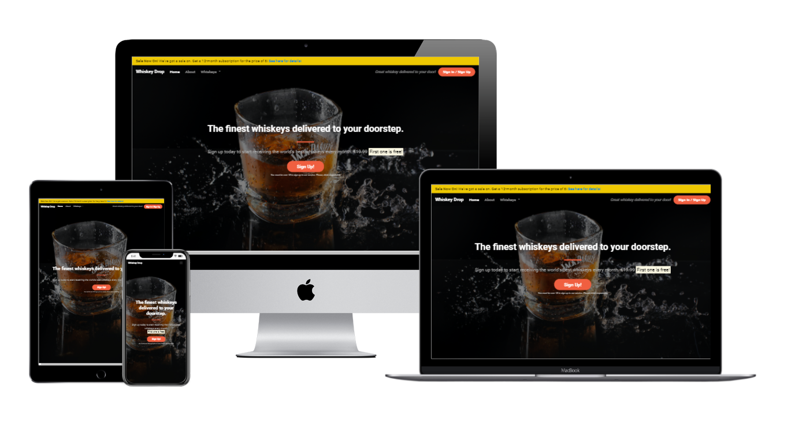

<h1 align="center">My Bootstrap Webpage</h1>

[View the live code here.](https://mattb859.github.io/mini-project-bootstrap/)

This is the main marketing website for Wiskey Drop. It is designed to be responsive and accessible on a range of devices, making it easy to navigate for customers.

 

<h2 align="center"></h2>

## User Experience (UX)

-    ## User stories

     -  #### First Time Visitor Goals

        1. As a Fisrt Time Visitor, I want to easily understand the main purpose of the site and learn more about the organisation.
        2. As a First Time Visitor, I want to be able to easily navigate throughout the site to find content.
        3. As a First Time Visitor, I want to look for testimonials to   understand what their users think of them and see if they are trusted. I also want to locate their social media links to see their followings on social media to determine how trusted and known they are.

     -  #### Returning Visitor Goals

         1. As a Returning Visitor, I want to find information about coding challenges.
        2. As a Returning Visitor, I want to find the best way to get in contact with the organisation with any questions I may have.
        3. As a Returning Visitor, I want to find community links.

